# Detection of Floating Objects


Check our [ISPRS Conference Paper (Annals)](https://www.isprs-ann-photogramm-remote-sens-spatial-inf-sci.net/V-3-2021/285/2021/) and please consider citing

> Mifdal, J., Longépé, N., and Rußwurm, M.: TOWARDS DETECTING FLOATING OBJECTS ON A GLOBAL SCALE WITH LEARNED SPATIAL FEATURES USING SENTINEL 2, ISPRS Ann. 
> Photogramm. Remote Sens. Spatial Inf. Sci., V-3-2021, 285–293, https://doi.org/10.5194/isprs-annals-V-3-2021-285-2021, 2021.

Check also our most recent publication [OCEANS Conference Paper](https://210507-004.oceansvirtual.com/view/content/skdwP611e3583eba2b/ecf65c2aaf278557ad05c213247d67a54196c9376a0aed8f1875681f182daeed)

> Carmo, R., Mifdal, J., and Rußwurm, M.: Detecting Macro Floating Objects on Coastal Water Bodies using Sentinel-2 Data, OCEANS 2021 San Diego – Porto, 2021.

## Getting Started

The dataset is assumed to be located at `/data`. It can be downloaded from [this link](https://drive.google.com/drive/folders/1QGjzRTVRQbf4YbzfUWMeIdJvYkzuipGJ?usp=sharing) with 
the script `python code/download.py /data`

### Environments

#### Anaconda

```
conda create -n floatingobjects pip
conda activate floatingobjects
conda install -c conda-forge gdal # GDAL needs to be conda installed
pip install -r requirements.txt
```

#### Docker

A docker with configured environment can be built and run via
```bash
# build
docker build -t floatingobjects .
# run
docker run -v /data:/data floatingobjects python main.py
```

### Predict

Usa a model snapshot (`--snapshot-path`) to predict floating objects on an image (`--image-path`). The results will be 
stored in as tif in the location specified by `--prediction-path`

```
python code/predictor.py --prediction-path "prediction.tif" \\
    --image-path "Limassol20181215_l2a.tif" \\
    --snapshot-path unet-posweight10-lr001-aug1.pth.tar
```

### Train

For the 5-fold training run
```
python code/main.py train --results-dir models --data-path /data
``` 

#### Load pretrained models using PyTorch Hub
Here you can load the models with pretrained weights from the 2-fold training of U-Net and MA-Net, according to what has been published in [OCEANS Conference Paper](https://210507-004.oceansvirtual.com/view/content/skdwP611e3583eba2b/ecf65c2aaf278557ad05c213247d67a54196c9376a0aed8f1875681f182daeed)
```python
import torch
unet_seed0 = torch.hub.load('ESA-PhiLab/floatingobjects:master', 'unet_seed0')
unet_seed1 = torch.hub.load('ESA-PhiLab/floatingobjects:master', 'unet_seed1')
manet_seed0 = torch.hub.load('ESA-PhiLab/floatingobjects:master', 'manet_seed0')
manet_seed1 = torch.hub.load('ESA-PhiLab/floatingobjects:master', 'manet_seed1')
```  

## Dataset

### Download

The dataset can be manually downloaded using [this link](https://drive.google.com/drive/folders/1QGjzRTVRQbf4YbzfUWMeIdJvYkzuipGJ?usp=sharing) and unzipped via
```
python code/download.py ./data/
```
to `./data`

## Dataset Overview and Predictions

Click on images for a detailed overview powered by the [COG-Explorer](https://geotiffjs.github.io/cog-explorer) of [EOX](https://eox.at/).

The RGB, NDVI, FDI overview created from the 12/13-band Sentinel 2 images with `code/create_overview_table.py`.


| Region/Date  | RGB | NDVI | [FDI](https://www.nature.com/articles/s41598-020-62298-z) | predictions |
| --- | --- | --- | --- | --- |
 | `accra_20181031` | [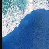](https://geotiffjs.github.io/cog-explorer/#scene=https://floatingobjects.s3.eu-central-1.amazonaws.com/data/accra_20181031_rgb.tif&bands=&pipeline=) | [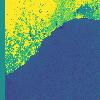](https://geotiffjs.github.io/cog-explorer/#scene=https://floatingobjects.s3.eu-central-1.amazonaws.com/data/accra_20181031_ndvi.tif&bands=&pipeline=) | [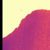](https://geotiffjs.github.io/cog-explorer/#scene=https://floatingobjects.s3.eu-central-1.amazonaws.com/data/accra_20181031_fdi.tif&bands=&pipeline=) | [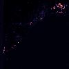](https://geotiffjs.github.io/cog-explorer/#scene=https://floatingobjects.s3.eu-central-1.amazonaws.com/predictions/accra_20181031_pred.tif&bands=&pipeline=) | 
 | `danang_20181005` | [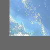](https://geotiffjs.github.io/cog-explorer/#scene=https://floatingobjects.s3.eu-central-1.amazonaws.com/data/danang_20181005_rgb.tif&bands=&pipeline=) | [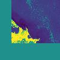](https://geotiffjs.github.io/cog-explorer/#scene=https://floatingobjects.s3.eu-central-1.amazonaws.com/data/danang_20181005_ndvi.tif&bands=&pipeline=) | [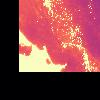](https://geotiffjs.github.io/cog-explorer/#scene=https://floatingobjects.s3.eu-central-1.amazonaws.com/data/danang_20181005_fdi.tif&bands=&pipeline=) | [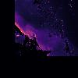](https://geotiffjs.github.io/cog-explorer/#scene=https://floatingobjects.s3.eu-central-1.amazonaws.com/predictions/danang_20181005_pred.tif&bands=&pipeline=) | 
 | `kolkata_20201115_l2a` | [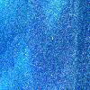](https://geotiffjs.github.io/cog-explorer/#scene=https://floatingobjects.s3.eu-central-1.amazonaws.com/data/kolkata_20201115_l2a_rgb.tif&bands=&pipeline=) | [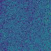](https://geotiffjs.github.io/cog-explorer/#scene=https://floatingobjects.s3.eu-central-1.amazonaws.com/data/kolkata_20201115_l2a_ndvi.tif&bands=&pipeline=) | [](https://geotiffjs.github.io/cog-explorer/#scene=https://floatingobjects.s3.eu-central-1.amazonaws.com/data/kolkata_20201115_l2a_fdi.tif&bands=&pipeline=) | [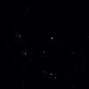](https://geotiffjs.github.io/cog-explorer/#scene=https://floatingobjects.s3.eu-central-1.amazonaws.com/predictions/kolkata_20201115_l2a_pred.tif&bands=&pipeline=) | 
 | `lagos_20190101_l2a` | [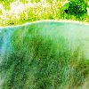](https://geotiffjs.github.io/cog-explorer/#scene=https://floatingobjects.s3.eu-central-1.amazonaws.com/data/lagos_20190101_l2a_rgb.tif&bands=&pipeline=) | [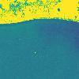](https://geotiffjs.github.io/cog-explorer/#scene=https://floatingobjects.s3.eu-central-1.amazonaws.com/data/lagos_20190101_l2a_ndvi.tif&bands=&pipeline=) | [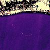](https://geotiffjs.github.io/cog-explorer/#scene=https://floatingobjects.s3.eu-central-1.amazonaws.com/data/lagos_20190101_l2a_fdi.tif&bands=&pipeline=) | [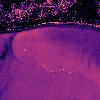](https://geotiffjs.github.io/cog-explorer/#scene=https://floatingobjects.s3.eu-central-1.amazonaws.com/predictions/lagos_20190101_l2a_pred.tif&bands=&pipeline=) | 
 | `longxuyen_20181102` | [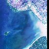](https://geotiffjs.github.io/cog-explorer/#scene=https://floatingobjects.s3.eu-central-1.amazonaws.com/data/longxuyen_20181102_rgb.tif&bands=&pipeline=) | [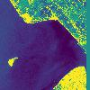](https://geotiffjs.github.io/cog-explorer/#scene=https://floatingobjects.s3.eu-central-1.amazonaws.com/data/longxuyen_20181102_ndvi.tif&bands=&pipeline=) | [](https://geotiffjs.github.io/cog-explorer/#scene=https://floatingobjects.s3.eu-central-1.amazonaws.com/data/longxuyen_20181102_fdi.tif&bands=&pipeline=) | [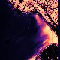](https://geotiffjs.github.io/cog-explorer/#scene=https://floatingobjects.s3.eu-central-1.amazonaws.com/predictions/longxuyen_20181102_pred.tif&bands=&pipeline=) | 
 | `mandaluyong_20180314` | [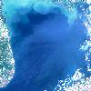](https://geotiffjs.github.io/cog-explorer/#scene=https://floatingobjects.s3.eu-central-1.amazonaws.com/data/mandaluyong_20180314_rgb.tif&bands=&pipeline=) | [](https://geotiffjs.github.io/cog-explorer/#scene=https://floatingobjects.s3.eu-central-1.amazonaws.com/data/mandaluyong_20180314_ndvi.tif&bands=&pipeline=) | [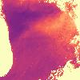](https://geotiffjs.github.io/cog-explorer/#scene=https://floatingobjects.s3.eu-central-1.amazonaws.com/data/mandaluyong_20180314_fdi.tif&bands=&pipeline=) | [](https://geotiffjs.github.io/cog-explorer/#scene=https://floatingobjects.s3.eu-central-1.amazonaws.com/predictions/mandaluyong_20180314_pred.tif&bands=&pipeline=) | 
 | `panama_20190425_l2a` | [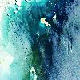](https://geotiffjs.github.io/cog-explorer/#scene=https://floatingobjects.s3.eu-central-1.amazonaws.com/data/panama_20190425_l2a_rgb.tif&bands=&pipeline=) | [](https://geotiffjs.github.io/cog-explorer/#scene=https://floatingobjects.s3.eu-central-1.amazonaws.com/data/panama_20190425_l2a_ndvi.tif&bands=&pipeline=) | [](https://geotiffjs.github.io/cog-explorer/#scene=https://floatingobjects.s3.eu-central-1.amazonaws.com/data/panama_20190425_l2a_fdi.tif&bands=&pipeline=) | [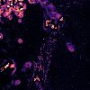](https://geotiffjs.github.io/cog-explorer/#scene=https://floatingobjects.s3.eu-central-1.amazonaws.com/predictions/panama_20190425_l2a_pred.tif&bands=&pipeline=) | 
 | `riodejaneiro_20180504_l2a` | [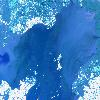](https://geotiffjs.github.io/cog-explorer/#scene=https://floatingobjects.s3.eu-central-1.amazonaws.com/data/riodejaneiro_20180504_l2a_rgb.tif&bands=&pipeline=) | [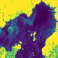](https://geotiffjs.github.io/cog-explorer/#scene=https://floatingobjects.s3.eu-central-1.amazonaws.com/data/riodejaneiro_20180504_l2a_ndvi.tif&bands=&pipeline=) | [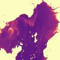](https://geotiffjs.github.io/cog-explorer/#scene=https://floatingobjects.s3.eu-central-1.amazonaws.com/data/riodejaneiro_20180504_l2a_fdi.tif&bands=&pipeline=) | [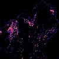](https://geotiffjs.github.io/cog-explorer/#scene=https://floatingobjects.s3.eu-central-1.amazonaws.com/predictions/riodejaneiro_20180504_l2a_pred.tif&bands=&pipeline=) | 
 | `sandiego_20180804_l2a` | [](https://geotiffjs.github.io/cog-explorer/#scene=https://floatingobjects.s3.eu-central-1.amazonaws.com/data/sandiego_20180804_l2a_rgb.tif&bands=&pipeline=) | [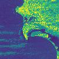](https://geotiffjs.github.io/cog-explorer/#scene=https://floatingobjects.s3.eu-central-1.amazonaws.com/data/sandiego_20180804_l2a_ndvi.tif&bands=&pipeline=) | [](https://geotiffjs.github.io/cog-explorer/#scene=https://floatingobjects.s3.eu-central-1.amazonaws.com/data/sandiego_20180804_l2a_fdi.tif&bands=&pipeline=) | [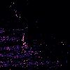](https://geotiffjs.github.io/cog-explorer/#scene=https://floatingobjects.s3.eu-central-1.amazonaws.com/predictions/sandiego_20180804_l2a_pred.tif&bands=&pipeline=) | 
 | `venice_20180630_l2a` | [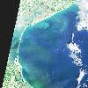](https://geotiffjs.github.io/cog-explorer/#scene=https://floatingobjects.s3.eu-central-1.amazonaws.com/data/venice_20180630_l2a_rgb.tif&bands=&pipeline=) | [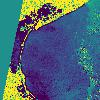](https://geotiffjs.github.io/cog-explorer/#scene=https://floatingobjects.s3.eu-central-1.amazonaws.com/data/venice_20180630_l2a_ndvi.tif&bands=&pipeline=) | [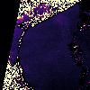](https://geotiffjs.github.io/cog-explorer/#scene=https://floatingobjects.s3.eu-central-1.amazonaws.com/data/venice_20180630_l2a_fdi.tif&bands=&pipeline=) | [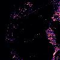](https://geotiffjs.github.io/cog-explorer/#scene=https://floatingobjects.s3.eu-central-1.amazonaws.com/predictions/venice_20180630_l2a_pred.tif&bands=&pipeline=) | 
 | `venice_20180928_l2a` | [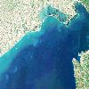](https://geotiffjs.github.io/cog-explorer/#scene=https://floatingobjects.s3.eu-central-1.amazonaws.com/data/venice_20180928_l2a_rgb.tif&bands=&pipeline=) | [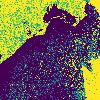](https://geotiffjs.github.io/cog-explorer/#scene=https://floatingobjects.s3.eu-central-1.amazonaws.com/data/venice_20180928_l2a_ndvi.tif&bands=&pipeline=) | [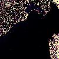](https://geotiffjs.github.io/cog-explorer/#scene=https://floatingobjects.s3.eu-central-1.amazonaws.com/data/venice_20180928_l2a_fdi.tif&bands=&pipeline=) | [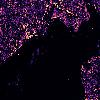](https://geotiffjs.github.io/cog-explorer/#scene=https://floatingobjects.s3.eu-central-1.amazonaws.com/predictions/venice_20180928_l2a_pred.tif&bands=&pipeline=) | 
 | `vungtau_20180423` | [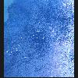](https://geotiffjs.github.io/cog-explorer/#scene=https://floatingobjects.s3.eu-central-1.amazonaws.com/data/vungtau_20180423_rgb.tif&bands=&pipeline=) | [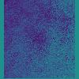](https://geotiffjs.github.io/cog-explorer/#scene=https://floatingobjects.s3.eu-central-1.amazonaws.com/data/vungtau_20180423_ndvi.tif&bands=&pipeline=) | [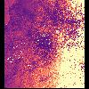](https://geotiffjs.github.io/cog-explorer/#scene=https://floatingobjects.s3.eu-central-1.amazonaws.com/data/vungtau_20180423_fdi.tif&bands=&pipeline=) | [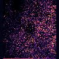](https://geotiffjs.github.io/cog-explorer/#scene=https://floatingobjects.s3.eu-central-1.amazonaws.com/predictions/vungtau_20180423_pred.tif&bands=&pipeline=) | 

## Tests

The `dataset.py` tests require a downloaded dataset 
```
export TESTS_DATA_ROOT=/data
python tests/dataset.py
```
and check if all samples of the datasets can be returned and that no overlap exists in the train/test splits.

## Bibtex

```
@Article{mifdal2021floating,
    AUTHOR = {Mifdal, J. and Long\'ep\'e, N. and Ru{\ss}wurm, M.},
    TITLE = {TOWARDS DETECTING FLOATING OBJECTS ON A GLOBAL SCALE WITH LEARNED SPATIAL FEATURES USING SENTINEL 2},
    JOURNAL = {ISPRS Annals of the Photogrammetry, Remote Sensing and Spatial Information Sciences},
    VOLUME = {V-3-2021},
    YEAR = {2021},
    PAGES = {285--293},
    URL = {https://www.isprs-ann-photogramm-remote-sens-spatial-inf-sci.net/V-3-2021/285/2021/},
    DOI = {10.5194/isprs-annals-V-3-2021-285-2021}
}
```
